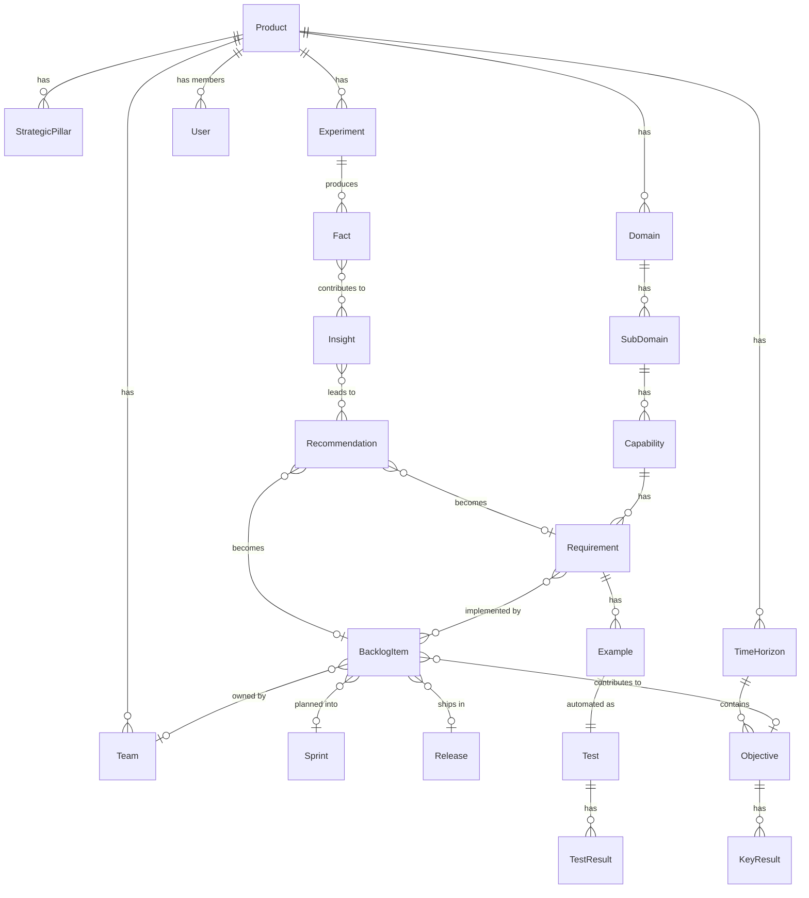

# Skald Domain Overview

Skald is an AI-native product development platform. This document provides an overview of all domains and their relationships.

## Domains

| Domain | Purpose | Status |
|--------|---------|--------|
| [Domain Knowledge](domain-knowledge/entities/_overview.md) | Entities, relationships, ubiquitous language, documentation | ✓ Documented |
| [Requirements](requirements/entities/_overview.md) | BDD features, scenarios, executable specs | ✓ Documented |
| [User Access](user-access/entities/_overview.md) | Multi-tenancy, users, products, roles | ✓ Documented |
| [Insights](insights/entities/_overview.md) | Atomic UX Research: Experiments, Facts, Insights, Recommendations | ✓ Documented |
| [Strategy](strategy/entities/_overview.md) | Strategic pillars, OKRs, time horizons | ✓ Documented |
| [Planning](planning/entities/_overview.md) | Releases, Backlog Items, Sprints, Teams | ✓ Documented |
| [Architecture](architecture/entities/_overview.md) | ADRs, tech stack, system design decisions | Pending |
| [Testing](testing/entities/_overview.md) | Acceptance tests tied to Examples | ✓ Documented (TBD details) |

## Cross-Domain Relationships



## Core Flow

```
Strategy → Domain Knowledge → Requirements → Planning → Code → Testing
```

1. **Strategy** - Set direction (strategic pillars, OKRs)
2. **Domain Knowledge** - Define the domain model (entities, capabilities, glossary)
3. **Requirements** - Specify what capabilities need (rules, examples)
4. **Planning** - Prioritize and plan work (backlog items contribute to objectives)
5. **Code** - Implement (external to Skald)
6. **Testing** - Verify examples pass (E2E tests)

## Shared Entities

Some entities are shared across domains:

| Entity | Primary Domain | Also Used In |
|--------|---------------|--------------|
| Product | User Access | Domain Knowledge, Planning, Strategy (tenant boundary) |
| Capability | Domain Knowledge | Requirements (contains requirements) |
| Example | Requirements | Testing (1:1 with Test) |
| Test | Testing | Requirements (automates Example) |
| BacklogItem | Planning | Requirements (implements), Strategy (contributes to), Insights (from recommendations) |
| Recommendation | Insights | Planning (becomes BacklogItem), Requirements (becomes Requirement) |
| Team | Planning | - |
| Objective | Strategy | Planning (backlog items contribute to) |
