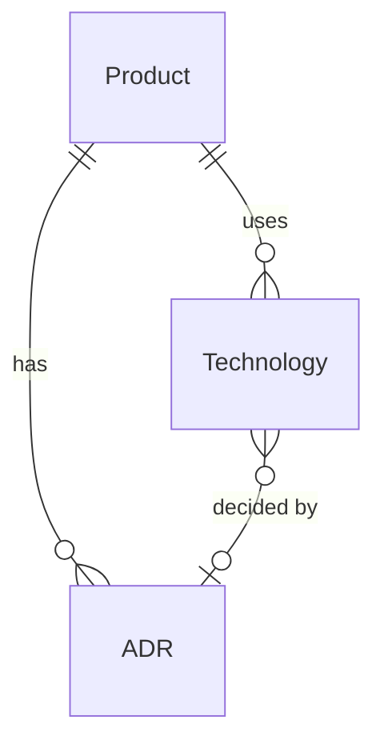

# Architecture - Entities Overview

The Architecture domain captures technical decisions and technology choices. It provides a record of why things are built the way they are.

## Entity Relationships



## Hierarchy

```
Product
├── ADR[] (architecture decision records)
└── Technology[] (tech stack)
    └── decided_by → ADR (optional)
```

## Entities in This Domain

| Entity | Description |
|--------|-------------|
| [ADR](adr.md) | Architecture Decision Record |
| [Technology](technology.md) | A technology in the stack |

## Key Concepts

- **ADRs**: Document significant technical decisions with context and consequences
- **Tech Stack**: List of technologies used, optionally linked to the ADR that chose them
- **Per-Product**: Both ADRs and technologies are scoped to a product
