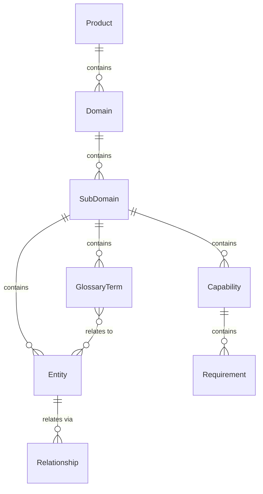

# Domain Knowledge - Entities Overview

The Domain Knowledge domain captures how users model their product's business domain. It provides a hierarchical structure for organizing entities, capabilities, and ubiquitous language.

## Entity Relationships



## Hierarchy

```
Product (tenant boundary)
└── Domain
    └── Sub-domain
        ├── Entity (with attributes, functions, relationships)
        ├── Capability
        └── Glossary Term
```

## Entities in This Domain

| Entity | Description |
|--------|-------------|
| [Product](product.md) | Tenant boundary, owns the domain model |
| [Domain](domain.md) | Top-level area of concern |
| [SubDomain](subdomain.md) | Nested area containing entities, capabilities, glossary |
| [Capability](capability.md) | What the system can do (verb-like) |
| [GlossaryTerm](glossary-term.md) | Domain vocabulary definition |
