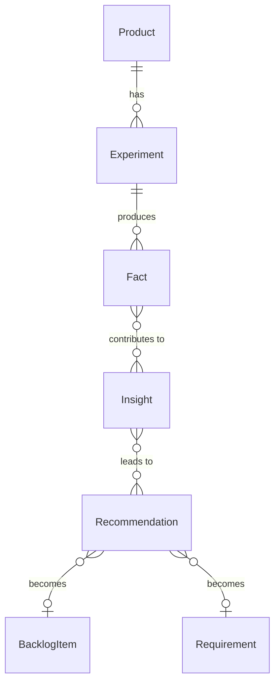

# Insights - Entities Overview

The Insights domain handles user research using the Atomic UX Research methodology. It captures observations, identifies patterns, and generates actionable recommendations.

## Entity Relationships



## Hierarchy

```
Product
└── Experiment[] (research sessions)
    └── Fact[] (observations)

Fact[] ──────► Insight (pattern)
Insight[] ───► Recommendation (action)

Recommendation ──► BacklogItem or Requirement
```

## Entities in This Domain

| Entity | Description |
|--------|-------------|
| [Experiment](experiment.md) | A research study or session |
| [Fact](fact.md) | An observation from an experiment |
| [Insight](insight.md) | A pattern identified across facts |
| [Recommendation](recommendation.md) | An action based on insights |

## Atomic UX Research Flow

1. **Experiment** - Conduct research (interviews, tests, etc.)
2. **Fact** - Record observations ("User clicked X expecting Y")
3. **Insight** - Identify patterns across facts ("Users expect Z behavior")
4. **Recommendation** - Propose actions ("Add Z feature" or "Change X flow")

## Cross-Domain Links

- Recommendations can become **BacklogItems** (work to do)
- Recommendations can become **Requirements** (capability specs)
