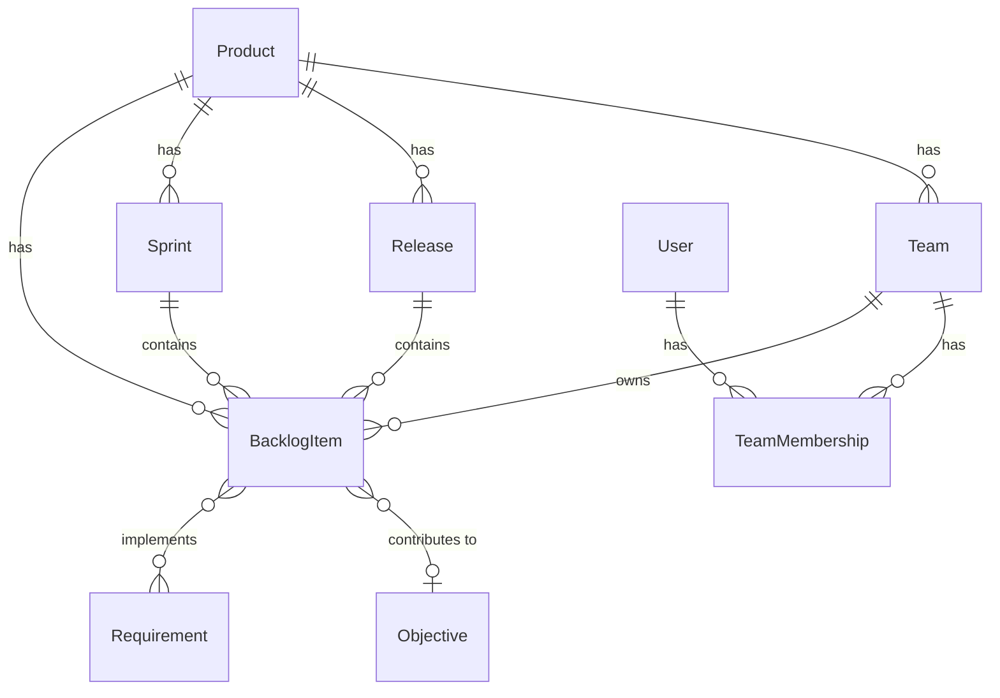

# Planning - Entities Overview

The Planning domain handles what work to do and when. It manages the product backlog, sprints, releases, and team assignments.

## Entity Relationships



## Hierarchy

```
Product
├── Team[]
│   ├── TeamMembership[] → User
│   └── owns BacklogItem[]
├── Sprint[]
│   └── contains BacklogItem[]
├── Release[]
│   └── contains BacklogItem[]
└── BacklogItem[] (ordered product backlog)
    ├── owned by Team
    ├── planned into Sprint
    ├── connected to Release
    ├── implements Requirement[]
    └── contributes to Objective (optional)
```

## Entities in This Domain

| Entity | Description |
|--------|-------------|
| [BacklogItem](backlog-item.md) | Something we've decided to do |
| [Sprint](sprint.md) | Time-boxed iteration |
| [Release](release.md) | A version/milestone to ship |
| [Team](team.md) | Group of users who work together |
| [TeamMembership](team-membership.md) | Links user to team |

## Key Concepts

- **Product Backlog**: Ordered list of BacklogItems at the product level
- **Team View**: Filtered view of backlog showing only a team's items
- **Sprints**: Shared across teams within a product
- **Releases**: Independent of sprints - items can ship in any release
- **Strategy Link**: Items can optionally contribute to [Objectives](../../strategy/entities/objective.md)
