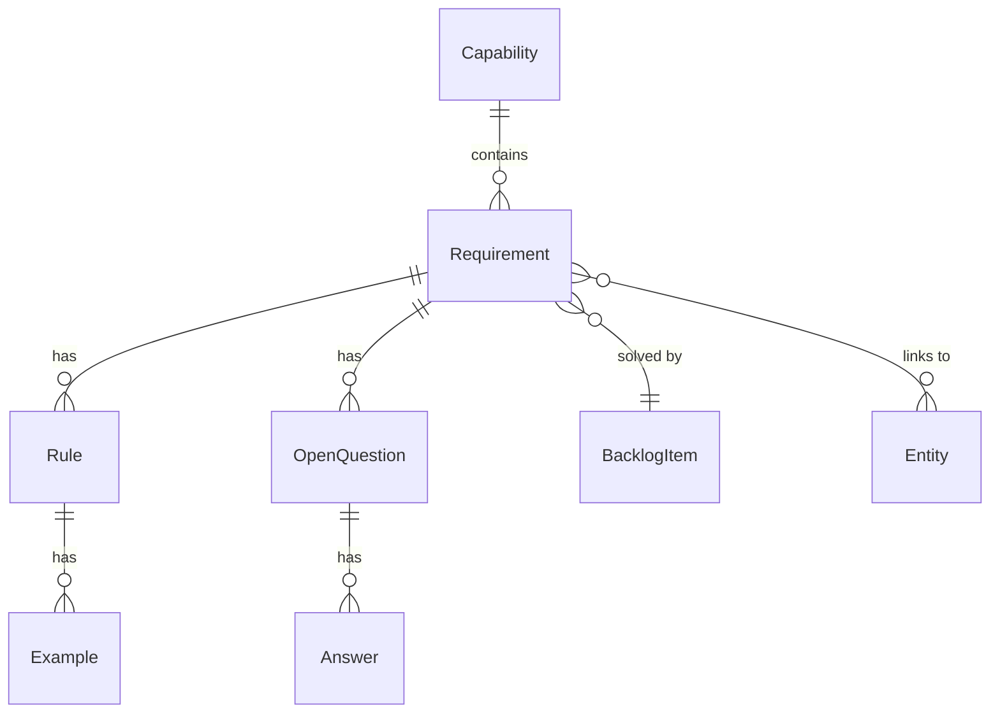

# Requirements - Entities Overview

The Requirements domain captures what the system should do, using Example Mapping and BDD principles. Requirements are tied to Capabilities from Domain Knowledge and solved by Backlog Items from Planning.

## Entity Relationships



## Hierarchy

```
Capability (from Domain Knowledge)
└── Requirement
    ├── Rule
    │   └── Example (Gherkin scenario)
    └── Open Question
        └── Answer
```

## Entities in This Domain

| Entity | Description |
|--------|-------------|
| [Requirement](requirement.md) | A capability need with rules and examples |
| [Rule](rule.md) | A business rule for a requirement |
| [Example](example.md) | A Gherkin scenario illustrating a rule |
| [OpenQuestion](open-question.md) | An unresolved ambiguity |
| [Answer](answer.md) | Resolution to an open question |
