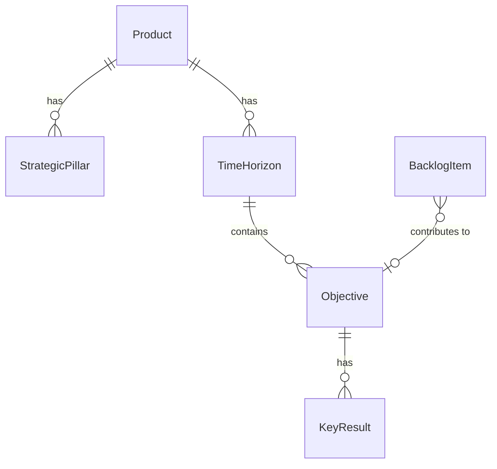

# Strategy and Goals - Entities Overview

The Strategy domain handles high-level direction and measurable outcomes. It provides the "why" behind the work through strategic pillars and OKRs (Objectives and Key Results).

## Entity Relationships



## Hierarchy

```
Product
├── StrategicPillar[] (independent themes/focus areas)
└── TimeHorizon[] (user-defined periods)
    └── Objective[]
        └── KeyResult[]
```

## Entities in This Domain

| Entity | Description |
|--------|-------------|
| [StrategicPillar](strategic-pillar.md) | High-level theme or focus area |
| [TimeHorizon](time-horizon.md) | User-defined time period (e.g., Q1 2026) |
| [Objective](objective.md) | Qualitative goal within a time horizon |
| [KeyResult](key-result.md) | Measurable outcome for an objective |

## Key Concepts

- **Strategic Pillars**: Independent themes that guide product direction (not tied to OKRs)
- **OKRs**: Objectives with measurable Key Results, scoped to Time Horizons
- **Time Horizons**: User-defined periods (quarterly, annual, or custom)
- **Contribution**: BacklogItems can optionally contribute to Objectives
