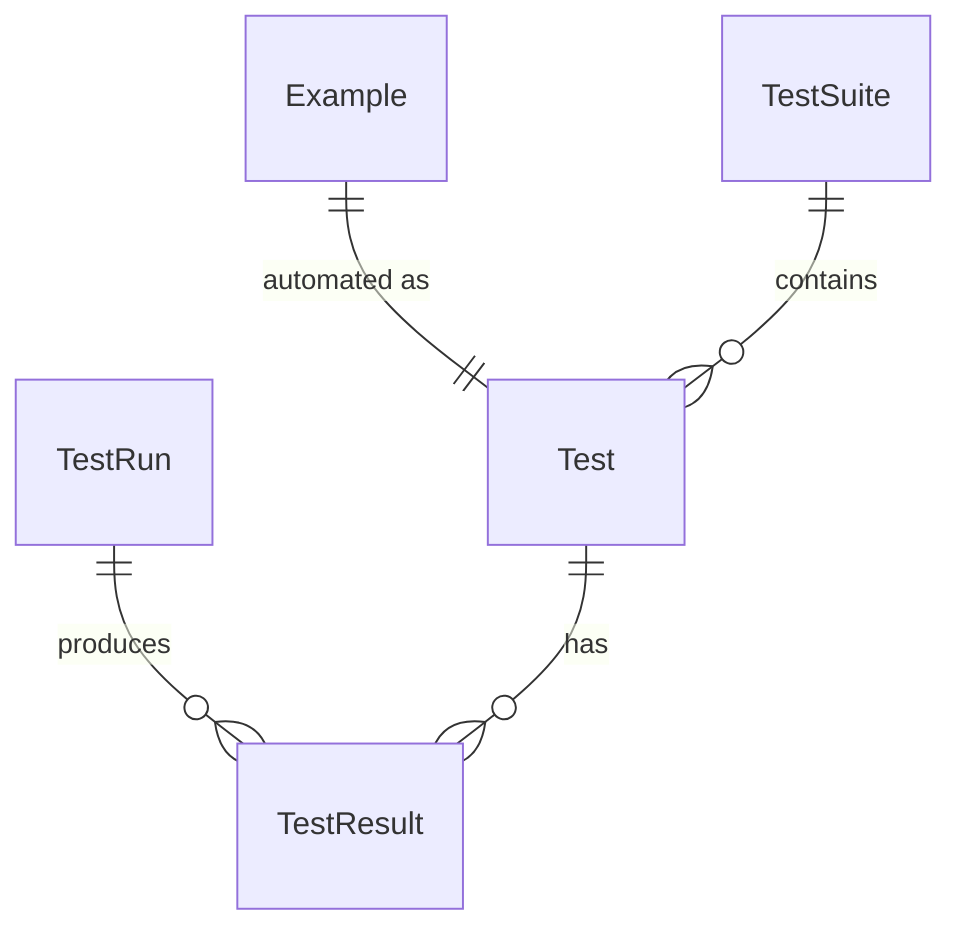

# Testing - Entities Overview

The Testing domain handles acceptance test automation. Examples from Requirements become executable tests, with tracked execution history.

> **Note:** This domain will be refined after a discovery session. Some details are marked as TBD.

## Entity Relationships



## Hierarchy

```
Example (from Requirements)
└── 1:1 → Test (executable test file)

TestSuite
└── Test[]

TestRun
└── TestResult[]
    └── for each Test
```

## Entities in This Domain

| Entity | Description | Status |
|--------|-------------|--------|
| [Test](test.md) | Executable test linked to an Example | Defined |
| [TestSuite](test-suite.md) | Group of related tests | TBD - scope unclear |
| [TestRun](test-run.md) | One execution of tests | TBD - attributes |
| [TestResult](test-result.md) | Outcome of a test in a run | TBD - details |

## Key Concepts

- **Acceptance Tests**: Focus on acceptance/E2E tests (e.g., Playwright)
- **Example → Test**: 1:1 relationship - each Example has one Test
- **Test History**: Track pass/fail over time via TestRuns
- **Triggers**: Manual or CI-triggered runs

## Open Questions (for discovery)

- TestSuite scope: per Capability? per Requirement? user-defined?
- TestRun attributes: environment, trigger source, duration?
- TestResult details: error messages, screenshots, logs?
