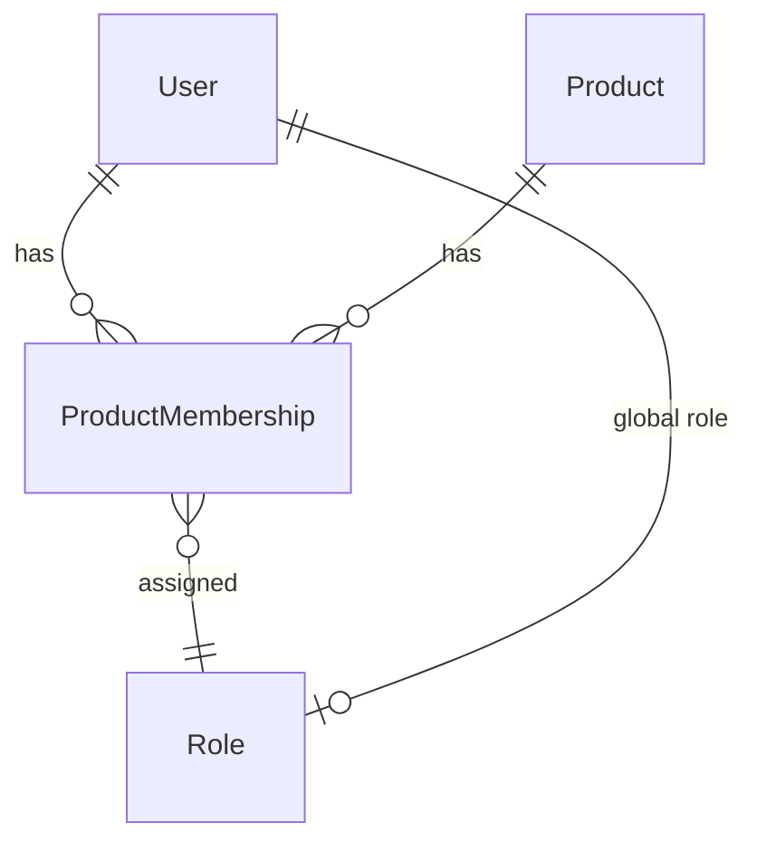

# User Access - Entities Overview

The User Access domain handles multi-tenancy, authentication, and authorization. Product is the tenant boundary - users are assigned roles per-product.

## Entity Relationships



## Hierarchy

```
User
├── Global Role (System Administrator)
└── ProductMembership[]
    ├── Product
    └── Role (per-product)
```

## Entities in This Domain

| Entity | Description |
|--------|-------------|
| [User](user.md) | A person who uses Skald |
| [Product](product.md) | Tenant boundary (shared with Domain Knowledge) |
| [ProductMembership](product-membership.md) | Links a user to a product with a role |
| [Role](role.md) | Permission level (global or per-product) |

## Roles

| Role | Scope | Description |
|------|-------|-------------|
| System Administrator | Global | Manage all products and users |
| Product Manager | Per-product | Full control of one product |
| Product Contributor | Per-product | Edit access, not admin |
| Product Viewer | Per-product | Read-only access |
